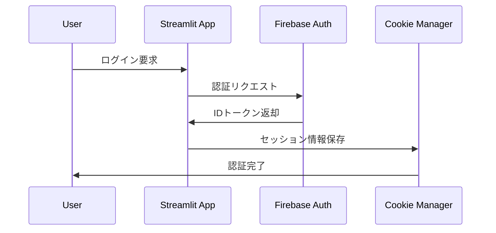

# 🦷 歯科国家試験AI対策アプリ - 詳細仕様書

> **Firebase認証・SM-2復習アルゴリズム・リアルタイムランキング搭載の学習プラットフォーム**

## 📋 目次

- [プロジェクト概要](#-プロジェクト概要)
- [アーキテクチャ・技術スタック](#-アーキテクチャ技術スタック)
- [機能詳細仕様](#-機能詳細仕様)
- [画面構成・UI仕様](#-画面構成ui仕様)
- [データベース設計](#-データベース設計)
- [学習アルゴリズム詳細](#-学習アルゴリズム詳細)
- [認証・セキュリティ](#-認証セキュリティ)
- [API・連携仕様](#-api連携仕様)
- [パフォーマンス最適化](#-パフォーマンス最適化)
- [運用・メンテナンス](#-運用メンテナンス)

---

## 🎯 プロジェクト概要

### アプリケーション概要
歯科医師国家試験と歯科医師学士編入試験の過去問を活用した、科学的根拠に基づく学習支援アプリケーション。間隔反復学習（SM-2アルゴリズム）とリアルタイム分析により、個人最適化された効率的な国試対策を提供します。

### 主要特徴
- **12,527問の豊富な問題データベース**（国試・学士試験対応）
- **SM-2アルゴリズム**による科学的な復習スケジューリング
- **Firebase連携**によるクラウド同期・認証システム
- **リアルタイムランキング**でモチベーション維持
- **高精度LaTeX PDF生成**で印刷教材対応
- **レスポンシブデザイン**でマルチデバイス対応

### 対象ユーザー
- 歯科医師国家試験受験生
- 歯科医師学士編入試験受験生
- 歯科関連教育機関
- 継続学習を行う歯科医師

---

## 🏗️ アーキテクチャ・技術スタック

### システム構成図
```
フロントエンド (Streamlit)
├── 認証システム (Firebase Auth)
├── アプリケーションロジック (Python)
├── データベース (Firebase Firestore)
├── セッション管理 (Cookie Manager)
└── 外部サービス (Google Analytics)
```

### 技術スタック詳細

#### フロントエンド
- **Streamlit** `1.36+`: Webアプリケーションフレームワーク
  - ライブリロード対応の開発環境
  - カスタムCSS/HTMLによるUI拡張
  - リアクティブコンポーネント
- **HTML/CSS/JavaScript**: カスタムスタイリング
  - レスポンシブデザイン実装
  - インタラクティブUI要素
  - プログレスバー・アニメーション

#### バックエンド
- **Python** `3.11+`: メインプログラミング言語
- **Firebase Admin SDK**: 認証・データベース連携
- **pandas/numpy**: データ処理・分析エンジン
- **Requests**: HTTP通信・API連携

#### データベース・認証
- **Firebase Firestore**: NoSQLクラウドデータベース
  - リアルタイム同期
  - オフライン対応
  - 自動スケーリング
- **Firebase Authentication**: ユーザー認証システム
  - メール・パスワード認証
  - セッション管理
  - セキュリティルール

#### PDF・ドキュメント生成
- **LaTeX**: 高品質ドキュメント組版
  - LuaTeX/XeTeX: 日本語フォント対応
  - tcolorbox: カスタムレイアウト
  - 数式・図表レンダリング

#### 分析・最適化
- **Plotly**: インタラクティブグラフ作成
- **Google Analytics**: ユーザー行動分析
- **pytz**: タイムゾーン処理（日本時間対応）

---

## 🚀 機能詳細仕様

### 1. 認証・アカウント管理システム

#### 1.1 ユーザー認証
```python
# 主要認証機能
class AuthManager:
    - firebase_signin(email, password): ログイン処理
    - firebase_signup(email, password): 新規登録
    - firebase_reset_password(email): パスワードリセット
    - refresh_auth_token(): トークンリフレッシュ
    - verify_session(): セッション検証
```

**機能詳細:**
- **自動ログイン**: Cookie連携による50分間セッション維持
- **Remember Me**: 長期ログイン機能
- **パスワードリセット**: Firebase連携による安全なリセット
- **トークン管理**: JWT自動リフレッシュシステム

#### 1.2 プロフィール管理
- **ニックネーム設定**: ランキング表示用
- **プライバシー設定**: ランキング参加可否選択
- **学習目標設定**: 1日の新規学習目標数
- **権限管理**: 学士試験アクセス権限

### 2. 学習システム（SM-2アルゴリズム）

#### 2.1 間隔反復学習エンジン
```python
def sm2_update_with_policy(card: dict, quality: int) -> dict:
    """SM-2アルゴリズムによるカード更新"""
    # Easy Factor (EF) 計算
    # 復習間隔計算
    # 習熟度レベル更新
    # 次回復習日設定
```

**アルゴリズム詳細:**
- **Easy Factor**: 1.3〜2.5の範囲で記憶の定着度を数値化
- **復習間隔**: 指数関数的増加（1日→6日→間隔×EF）
- **習熟度レベル**: 6段階（レベル0〜5 + エキスパート）
- **忘却リスク管理**: 期限切れカードの優先度調整

#### 2.2 学習モード

##### おまかせ学習モード
- **AI推奨システム**: 個人の学習状況に基づく最適問題選出
- **復習優先制御**: 期限切れカードの自動優先順位付け
- **新規学習バランス**: 復習と新規学習の最適比率計算
- **セッション時間管理**: 10分/20分/30分の時間別セッション

##### 自由演習モード
- **回数別学習**: 特定年度・領域の集中学習
- **科目別学習**: 専門分野別の体系的学習
- **必修問題**: 国試・学士必修問題の重点学習
- **キーワード検索**: 自由なテーマ設定

### 3. リアルタイムランキングシステム

#### 3.1 ランキング種別
```python
class RankingCalculator:
    - calculate_weekly_points(): 週間アクティビティポイント
    - calculate_total_points(): 累積学習ポイント  
    - calculate_mastery_score(): 習熟度スコア
    - update_user_ranking_scores(): リアルタイム更新
```

**ポイント算出ロジック:**
- **週間ポイント**: 7日間の学習活動量（復習+新規×重み）
- **総合ポイント**: 累積学習量・正答率・継続日数の複合指標
- **習熟度スコア**: エキスパートレベルカード比率×高度化指標

#### 3.2 即時反映システム
- **セッション状態連携**: 自己評価完了と同時にスコア更新
- **デバッグ情報**: 管理者向け計算過程表示
- **手動再計算**: ランキング異常時の修正機能

### 4. 検索・進捗分析システム

#### 4.1 高度検索機能
- **全文検索**: 問題文・選択肢・解説の横断検索
- **分野フィルター**: 標準化された科目分類による絞り込み
- **習熟度フィルター**: 学習状況による問題選別
- **複合条件**: 複数条件の論理演算検索

#### 4.2 学習分析ダッシュボード
```python
# 主要分析指標
- 学習進捗率: 完了問題数/総問題数
- 習熟度分布: レベル別カード枚数の円グラフ  
- 科目別正答率: 分野別パフォーマンス分析
- 学習継続性: 日別・週別学習パターン
```

### 5. PDF生成・出力システム

#### 5.1 LaTeX PDF生成
```latex
% カスタムテンプレート例
\documentclass[a4paper,11pt]{ltjsarticle}
\usepackage{tcolorbox, graphicx, amsmath}
\tcbuselibrary{breakable, skins}

% 問題ボックススタイル
\newtcolorbox{questionbox}[1][]{
    colback=blue!5!white, colframe=blue!50!black,
    title=#1, fonttitle=\bfseries,
    breakable, enhanced
}
```

**生成機能:**
- **日本語完全対応**: LuaTeX/XeTeXによるフォント処理
- **画像自動配置**: 高解像度画像の最適レイアウト
- **数式レンダリング**: LaTeX数式の完全再現
- **カスタマイズ**: ユーザー指定フォーマット

---

## 🖥️ 画面構成・UI仕様

### メイン画面構成
```
├── ヘッダー（認証状態・ナビゲーション）
├── サイドバー（学習ハブ・設定）
├── メインコンテンツエリア
│   ├── 練習ページ
│   ├── 検索・進捗ページ  
│   └── ランキングページ
└── フッター（アプリ情報）
```

### 1. 練習ページ（メインページ）

#### 1.1 サイドバー構成
```
🎓 学習ハブ
├── 学習モード選択
│   ├── おまかせ学習（推奨）
│   └── 自由演習（分野・回数指定）
├── 📅 本日の学習目標・復習スケジュール
│   ├── 復習期限カード数表示
│   ├── 新規学習目標数設定
│   ├── 本日の進捗メトリクス
│   └── 週間復習スケジュール
├── 学習設定
│   ├── セッション時間選択
│   ├── 問題条件設定
│   └── 出題順設定
└── 📚 学習キュー状況・復習スケジュール
```

#### 1.2 メインコンテンツ
- **問題表示エリア**: 高解像度画像・LaTeX数式対応
- **選択肢エリア**: シャッフル機能・マルチセレクト対応
- **自己評価システム**: 6段階評価（Again, Hard, Good, Easy）
- **進捗表示**: リアルタイム学習状況・セッション進度

### 2. 検索・進捗ページ

#### 2.1 メトリクスダッシュボード
```
学習指標（4つのメトリクス）
├── 学習進捗率: 完了数/総数 (前日比)
├── 習熟度分布: レベル別分布 (変化率)  
├── 本日の学習: 学習数 (昨日比)
└── 直近正答率: 週平均 (前週比)
```

#### 2.2 タブ構成
- **概要タブ**: 学習状況サマリー・全体統計
- **グラフ分析タブ**: Plotlyによる可視化分析
- **問題リストタブ**: 条件絞り込み・詳細表示
- **キーワード検索タブ**: 全文検索・高度フィルター

### 3. ランキングページ

#### 3.1 ランキング種別タブ
- **週間アクティブ**: 7日間の学習活動量ランキング
- **総合ランキング**: 累積ポイント・総合成績
- **習熟度ランキング**: エキスパートレベル到達度

#### 3.2 表示要素
- **自分の順位**: リアルタイム更新される現在の順位
- **ランキング表**: プログレスバー付きデータ表示
- **統計情報**: 全体統計・分布データ

---

## 🗄️ データベース設計

### Firebase Firestore スキーマ

#### 1. ユーザーデータ（users コレクション）
```json
{
  "uid": "user_identifier",
  "cards": {
    "Q12345": {
      "interval": 6,
      "easy_factor": 2.5,
      "level": 3,
      "due_date": "2025-09-15",
      "repetitions": 3,
      "last_reviewed": "2025-09-08"
    }
  },
  "result_log": {
    "Q12345": {
      "timestamp": "2025-09-08T10:30:00Z",
      "quality": 4,
      "response_time": 45
    }
  },
  "settings": {
    "new_cards_per_day": 15,
    "study_time_preference": "morning"
  }
}
```

#### 2. ランキングデータ
```json
// weekly_ranking コレクション
{
  "uid": "user_identifier", 
  "weekly_points": 850,
  "total_points": 12500,
  "rank": 15,
  "accuracy_rate": 78.5,
  "nickname": "頑張る歯科学生"
}

// total_ranking コレクション  
{
  "uid": "user_identifier",
  "total_points": 25000,
  "total_problems": 3500,
  "rank": 8,
  "accuracy_rate": 82.1
}

// mastery_ranking コレクション
{
  "uid": "user_identifier",
  "mastery_score": 75.2,
  "expert_cards": 450,
  "advanced_cards": 280,
  "total_cards": 1200,
  "avg_ef": 2.3
}
```

#### 3. 問題データ（master_questions）
```json
{
  "number": "116A001",
  "year": 2024,
  "session": "A", 
  "question": "歯科医師法で定められているのはどれか。",
  "choices": ["A. 選択肢1", "B. 選択肢2", "C. 選択肢3"],
  "answer": "B",
  "explanation": "詳細な解説...",
  "subject": "歯科医学総論",
  "is_required": true,
  "difficulty": "medium",
  "image_url": "https://...",
  "case_id": "case_116A_001"
}
```

---

## 🧠 学習アルゴリズム詳細

### SM-2 (Super Memo 2) アルゴリズム実装

#### 1. アルゴリズム核心ロジック
```python
def sm2_algorithm(card: dict, quality: int) -> dict:
    """
    SM-2アルゴリズムによるカード更新
    
    Args:
        card: カードデータ
        quality: 0-5の自己評価値
    
    Returns:
        更新されたカードデータ
    """
    # Easy Factor 更新
    ef = card.get('easy_factor', 2.5)
    ef = max(1.3, ef + (0.1 - (5 - quality) * (0.08 + (5 - quality) * 0.02)))
    
    # 復習間隔計算
    if quality < 3:  # 失敗
        interval = 1
        repetitions = 0
    else:  # 成功
        repetitions = card.get('repetitions', 0) + 1
        if repetitions == 1:
            interval = 1
        elif repetitions == 2:
            interval = 6
        else:
            interval = int(card.get('interval', 1) * ef)
    
    # レベル更新ロジック
    level = calculate_level(repetitions, quality, ef)
    
    return {
        'easy_factor': round(ef, 2),
        'interval': interval,
        'repetitions': repetitions,
        'level': level,
        'due_date': (datetime.now() + timedelta(days=interval)).isoformat(),
        'last_reviewed': datetime.now().isoformat()
    }
```

#### 2. 習熟度レベルシステム
```python
LEVEL_DEFINITIONS = {
    0: "初学者",      # EF < 1.8, 連続成功 < 2
    1: "練習生",      # EF 1.8-2.0, 連続成功 2-3
    2: "発展途上",    # EF 2.0-2.2, 連続成功 3-5
    3: "中級者",      # EF 2.2-2.4, 連続成功 5-8
    4: "上級者",      # EF 2.4-2.6, 連続成功 8-12
    5: "エキスパート", # EF > 2.6, 連続成功 > 12
}
```

#### 3. 復習スケジューリング
```python
def get_review_priority_cards(cards: dict, today: date) -> List[tuple]:
    """復習優先度の計算"""
    priority_cards = []
    
    for q_id, card in cards.items():
        due_date = parse_date(card.get('due_date'))
        if due_date <= today:
            # 期限切れ日数による優先度計算
            days_overdue = (today - due_date).days
            priority_score = days_overdue * 10 + (6 - card.get('level', 0))
            priority_cards.append((q_id, priority_score, days_overdue))
    
    return sorted(priority_cards, key=lambda x: x[1], reverse=True)
```

---

## 🔐 認証・セキュリティ

### Firebase Authentication連携

#### 1. 認証フロー


#### 2. セキュリティ機能
- **IDトークン検証**: Firebase Admin SDK による署名検証
- **セッション管理**: 50分間の自動更新
- **CSRF対策**: セッション状態トークンによる保護
- **Cookie暗号化**: AES暗号化によるセッション保護

#### 3. 権限管理
```python
def check_user_permissions(uid: str) -> dict:
    """ユーザー権限チェック"""
    permissions = {
        'can_access_gakushi': False,  # 学士試験アクセス権
        'can_export_pdf': True,      # PDF出力権限
        'can_view_ranking': True,    # ランキング表示権限
        'daily_limit': 100           # 1日の学習制限
    }
    
    # Firestoreから権限設定を取得
    user_profile = get_user_profile(uid)
    if user_profile:
        permissions.update(user_profile.get('permissions', {}))
    
    return permissions
```

---

## 📡 API・連携仕様

### 1. Firebase Firestore API
```python
class FirestoreManager:
    """Firestore操作の統一管理"""
    
    def save_user_data(self, uid: str, data: dict) -> bool:
        """ユーザーデータの保存"""
        
    def load_user_data(self, uid: str) -> dict:
        """ユーザーデータの読み込み"""
        
    def update_ranking_scores(self, uid: str, scores: dict) -> bool:
        """ランキングスコアの更新"""
        
    def get_ranking_data(self, ranking_type: str, limit: int) -> list:
        """ランキングデータの取得"""
```

### 2. Google Analytics 連携
```python
def log_learning_event(event_name: str, parameters: dict):
    """学習イベントのAnalytics送信"""
    ga_data = {
        'name': event_name,
        'parameters': {
            'user_id': parameters.get('uid'),
            'question_id': parameters.get('q_id'),
            'quality_score': parameters.get('quality'),
            'session_type': parameters.get('session_type'),
            'timestamp': datetime.now().isoformat()
        }
    }
    # Google Analytics Measurement Protocol
    send_to_analytics(ga_data)
```

### 3. 外部サービス連携
- **LaTeX Cloud Compilation**: Overleaf API連携（オプション）
- **画像配信CDN**: Firebase Storage Integration
- **メール通知**: SendGrid API（学習リマインダー）
- **データバックアップ**: Google Cloud Storage

---

## ⚡ パフォーマンス最適化

### 1. キャッシュ戦略
```python
@st.cache_data(ttl=3600)  # 1時間キャッシュ
def load_master_questions() -> dict:
    """問題データの高速キャッシュ読み込み"""
    
@st.cache_data(ttl=300)   # 5分キャッシュ
def get_user_statistics(uid: str) -> dict:
    """ユーザー統計の高速計算"""
    
@st.cache_data(ttl=1800)  # 30分キャッシュ  
def generate_ranking_data() -> list:
    """ランキングデータの計算キャッシュ"""
```

### 2. データベース最適化
- **複合インデックス**: 検索クエリの高速化
- **バッチ処理**: 複数データの一括更新
- **レプリケーション**: 読み取り専用レプリカの活用
- **接続プーリング**: データベース接続の効率管理

### 3. フロントエンド最適化
```python
# セッション状態の最適化
if 'optimization_flags' not in st.session_state:
    st.session_state.optimization_flags = {
        'lazy_load_images': True,
        'compress_user_data': True,
        'batch_analytics': True
    }

# 大量データの分割表示
def paginated_display(data: list, page_size: int = 50):
    """ページネーション付きデータ表示"""
```

---

## 🛠️ 運用・メンテナンス

### 1. モニタリング・ログ
```python
import logging

# 構造化ログ設定
logging.basicConfig(
    level=logging.INFO,
    format='%(asctime)s - %(name)s - %(levelname)s - %(message)s',
    handlers=[
        logging.FileHandler('app.log'),
        logging.StreamHandler()
    ]
)

def log_user_action(uid: str, action: str, details: dict):
    """ユーザーアクション記録"""
    log_data = {
        'uid': uid,
        'action': action,
        'details': details,
        'timestamp': datetime.now().isoformat(),
        'user_agent': st.session_state.get('user_agent')
    }
    logger.info(f"USER_ACTION: {json.dumps(log_data)}")
```

### 2. エラーハンドリング
```python
class AppException(Exception):
    """アプリケーション固有例外"""
    
def safe_operation(func):
    """安全な操作実行デコレータ"""
    def wrapper(*args, **kwargs):
        try:
            return func(*args, **kwargs)
        except Exception as e:
            log_error(f"Operation failed: {func.__name__}", e)
            return None
    return wrapper
```

### 3. データバックアップ・復旧
- **定期バックアップ**: 毎日午前3時に全データバックアップ
- **増分バックアップ**: 1時間毎の変更分バックアップ
- **災害復旧**: 複数リージョンでのデータレプリケーション
- **データ移行**: バージョンアップ時の互換性保証

### 4. セキュリティ監査
```python
def security_audit():
    """セキュリティ監査チェック"""
    checks = [
        check_firebase_rules(),      # Firestoreセキュリティルール
        check_user_permissions(),    # ユーザー権限の整合性
        check_data_encryption(),     # データ暗号化状態
        check_session_security(),    # セッション管理の安全性
    ]
    return all(checks)
```

---

## 📊 KPI・成果指標

### 学習効果指標
- **学習継続率**: 30日間の継続学習ユーザー比率
- **成績向上**: 模試スコア・正答率の向上度
- **復習効率**: SM-2アルゴリズムによる記憶定着率
- **モチベーション**: ランキング参加率・アクティブ日数

### システム品質指標
- **応答速度**: ページ読み込み時間（3秒以内）
- **可用性**: システム稼働率（99.9%以上）
- **エラー率**: 操作エラー発生率（0.1%以下）
- **セキュリティ**: 認証関連インシデント（0件）

---

## 🔮 今後の拡張予定

### 短期計画（3ヶ月）
- [ ] **音声問題対応**: 聴力検査・症例音声の再生機能
- [ ] **解説動画**: 重要問題の動画解説統合
- [ ] **学習リマインダー**: メール・プッシュ通知システム
- [ ] **オフライン学習**: PWA対応による圏外学習

### 中期計画（6ヶ月）
- [ ] **チーム学習**: グループ学習・競争機能
- [ ] **AIパーソナライズ**: 機械学習による最適化推薦
- [ ] **VR対応**: 仮想現実での臨床シミュレーション
- [ ] **多言語対応**: 英語・中国語での国際展開

### 長期計画（1年）
- [ ] **スマートフォンアプリ**: React Native による ネイティブアプリ
- [ ] **AI解説生成**: GPTによる動的解説作成
- [ ] **ブロックチェーン**: 資格証明・実績の分散管理
- [ ] **教育機関連携**: 大学・専門学校との公式連携

---

## 📝 まとめ

本アプリケーションは、科学的根拠に基づく学習理論と最新のクラウド技術を組み合わせた、次世代型の歯科国家試験対策プラットフォームです。

**主要な技術的特徴:**
- SM-2アルゴリズムによる個人最適化学習
- Firebase完全連携によるリアルタイム同期
- モジュール化されたスケーラブルなアーキテクチャ
- 高精度LaTeX PDF生成による印刷対応

**ユーザーメリット:**
- 効率的な復習スケジューリング
- モチベーション維持のランキング機能
- 豊富な問題データベース（12,527問）
- マルチデバイス対応の学習環境

継続的な機能改善と技術革新により、歯科教育の質向上と受験生の学習効率最大化を実現していきます。

---

**作成者**: eddy (eddy80524@gmail.com)  
**最終更新**: 2025年9月2日  
**バージョン**: 1.0.0
